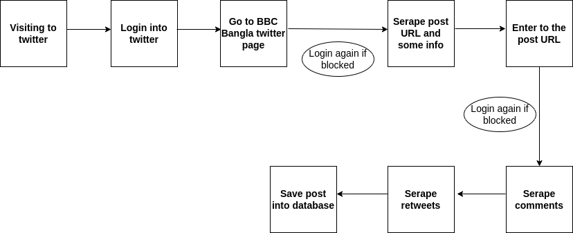
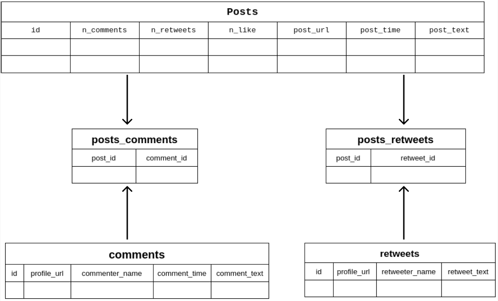

# Twitter scraping
**Scraping algorithm**


**Install libraries**
```sh
 python3 -m venv venv
 . venv/bin/activate
 pip install -r requirements.txt
```
**Put Twitter credential**
* Put valid twitter username, email and password to line number 321 of **main.py**
```sh
 twitter = Twitter('Your user name', 'Your email', 'password')
```
**Run the scraping**
```sh
 python main.py
```
**Sample output file**
```sh
 DATA.json
```

**Database design**

